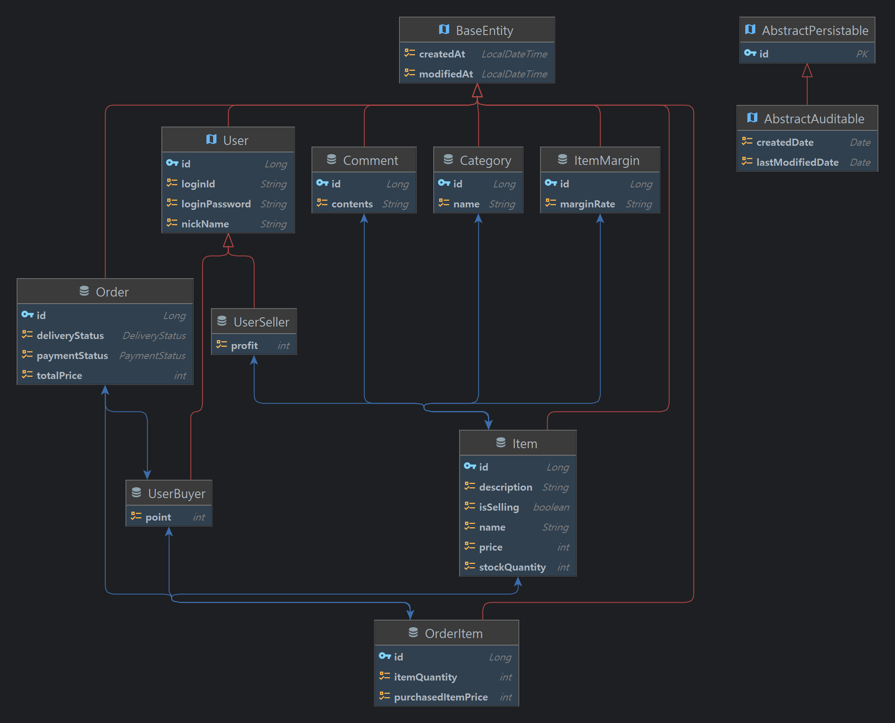

# 쇼핑몰 프로젝트(2024.04.07 BE)

## 관리자

- 상품 별 '마진율'을 설정할 수 있다.
- 상품을 판매 중단 및 재개 처리할 수 있다.

## 구매자

- 상품 목록을 조회할 수 있다.
- 상품을 카테고리별로 조회할 수 있다.
- 상품을 검색할 수 있다.
- 상품 구매 후기를 작성할 수 있다.
- 구매 후기를 작성하면 리워드를 지급받는다.
- 상품 배송 현황을 확인할 수 있다.
- 배송 시작 전 단계의 상품을 환불할 수 있다.

## 판매자

- 상품을 업로드할 수 있다.
- 상품의 배송 상태를 변경할 수 있다.
- 상품을 판매 중단 및 재개 처리할 수 있다.
- 자신이 판매 중인 상품 목록을 확인할 수 있다.
- 일간 총 수익을 확인할 수 있다.

